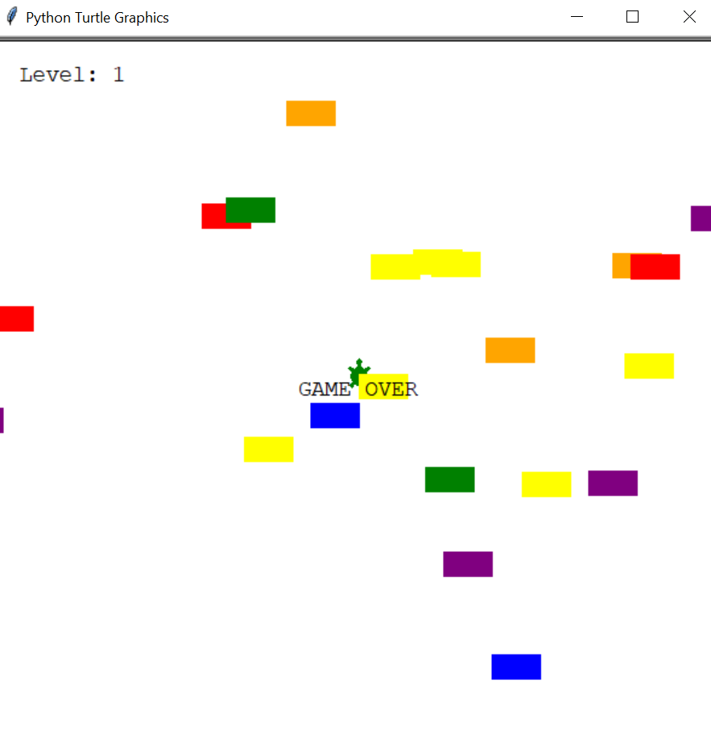

_This README.md file is in English and Portuguese. // Esse arquivo README.md está em Inglês e Português._

# The Turtle Cross-the-Street Game | Python

⚠️ _This was done as I followed up Angela Yu's Python Bootcamp tutorial on the Turtle-Cross-The-Street-Game. You can find the course [on Udemy here](https://www.udemy.com/course/100-days-of-code/)._ ⚠️

In this game, you control a turtle and must help him cross the street. Lots of cars are coming your way. You gotta watch out! As you reach the other side, a new level comes up... and cars are faster.

The Turtle Module was used for this game. Concepts of Object Oriented Programming (OOP) were also used.

# O Jogo da Tartaruga-que-Cruza-a-Rua | Python

 ⚠️ _Isso foi criado enquanto eu seguia o tutorial do Jogo Tartaruga Cruzando a Rua do Bootcamp de Python da Angela Yu. O curso está [disponível na Udemy aqui](https://www.udemy.com/course/100-days-of-code/)_. ⚠️

Nesse jogo, você controla uma tartaruga e deve ajudá-la a cruzar a rua. Muitos carros coloridos vêm na sua direção. Você precisa cuidar! Assim que chegar do outro lado, uma nova fase começa... e os carros estão mais rápidos.

O módulo da tartaruga (Turtle Module) foi usado para esse jogo, bem como conceitos da Programação Orientada a Objetos (POO).
